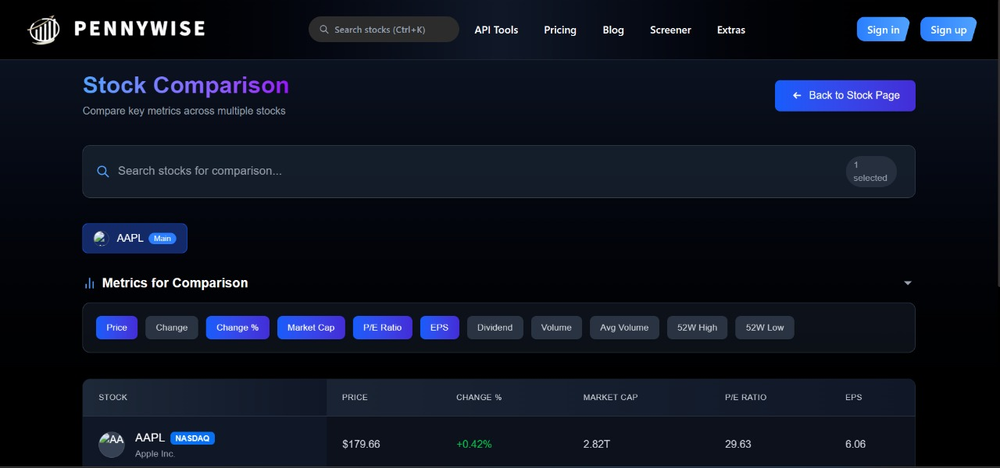
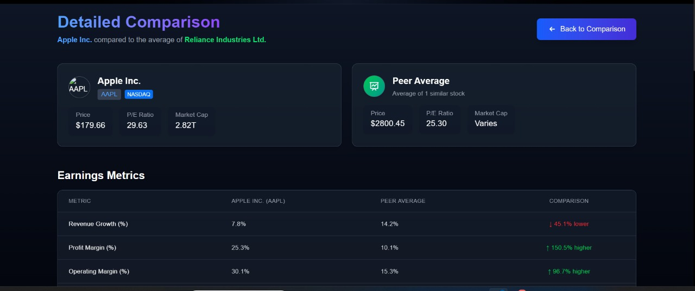
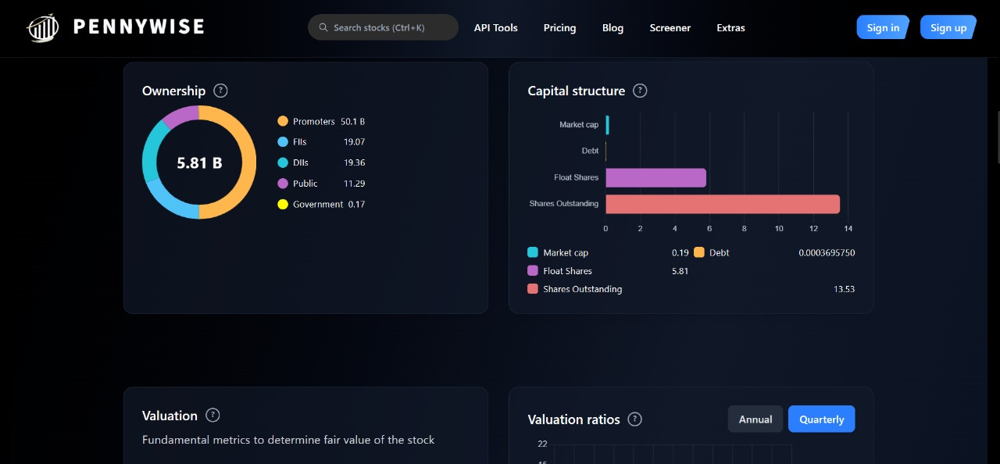

# 💸 Pennywise: The Ultimate AI-Powered Stock Analytics Platform

---

## 🌟 Project Overview

**Pennywise** is a full-stack, ML-driven stock analytics platform designed to empower investors with actionable insights, advanced analytics, and seamless user experience. The project integrates real-time data ingestion, technical and fundamental analysis, machine learning, and a modern web interface to deliver a one-stop solution for stock market research and decision-making.

---

## 🖼️ Screenshots

| Peer Selection | Peer Comparison  | Candlestick Patterns |
|-----------|----------------|---------------------|
|  |  |  |

| Financials View | Channels & Trendlines | 
|-----------------|----------------------|---------------------|
|  |  | 

## 🧠 What Makes Pennywise Stand Out?

### 1. **Comprehensive Data Pipeline**
- **Automated Data Fetching:**  
  - Uses [yfinance](https://github.com/ranaroussi/yfinance) to fetch historical and real-time stock data from multiple exchanges (NSE/BSE) with intelligent fallback.
  - Scheduled and on-demand updates for both daily and minute-level data.
- **Robust Database Design:**  
  - SQLAlchemy ORM models for stocks, price data, technicals, fundamentals, quarterly results, support/resistance, and more.
  - Handles data integrity, relationships, and efficient querying.

### 2. **Advanced Technical Analysis**
- **Candlestick Pattern Recognition:**  
  - Identifies all major single and double candlestick patterns (Doji, Hammer, Engulfing, Dark Cloud Cover, etc.) using custom algorithms.
- **Support & Resistance Detection:**  
  - Dynamic calculation and updating of support/resistance levels with retest tracking and pattern annotation.
- **Channel & Trendline Generation:**  
  - **Automatic detection and plotting of price channels (upper/lower) and trendlines** using regression and clustering, helping users visualize price boundaries and momentum.
- **Divergence Strategy:**  
  - **Automated detection of bullish and bearish divergences** between price and indicators like RSI or OBV, highlighting potential reversal points and trading opportunities.
- **Indicator Suite:**  
  - Calculates RSI, OBV, and other technical indicators on-the-fly for multiple timeframes.

### 3. **Deep Fundamental Analysis**
- **Financial Statement Parsing:**  
  - Scrapes and parses quarterly and annual financials from sources like Screener.in.
  - Extracts and structures key metrics: Total Assets, Equity, Debt, Cash, Retained Earnings, etc.
- **Key Ratio Computation:**  
  - Calculates ROIC, equity capital, invested capital, and other advanced ratios.
- **Peer Comparison Engine:**  
  - Enables side-by-side comparison of stocks on both technical and fundamental metrics.

### 4. **Modern, Interactive Frontend**
- **React + Material UI:**  
  - Responsive, visually appealing dashboards and pages.
  - Interactive charts (candlestick, line, bar) with real-time updates.
- **Detailed Comparison Views:**  
  - Compare multiple stocks across dozens of metrics with color-coded performance indicators.
- **User Experience:**  
  - Intuitive navigation, instant feedback, and clear data presentation.

### 5. **Scalable, Modular Backend**
- **FastAPI Framework:**  
  - High-performance REST API for all data operations.
  - Modular routers for admin, stock, technicals, and more.
- **Error Handling & Logging:**  
  - Graceful error recovery, rollback on failures, and informative logging for debugging and monitoring.

### 6. **Machine Learning & Analytics**
- **Clustering & Pattern Discovery:**  
  - Uses scikit-learn for price clustering and anomaly detection.
- **Element-wise Financial Calculations:**  
  - Handles vectorized operations for multi-year financial data using NumPy and Pandas.

### 7. **DevOps & Best Practices**
- **Environment Management:**  
  - Requirements files for easy setup.
- **Code Quality:**  
  - Modular, well-documented codebase with clear separation of concerns.
- **Extensibility:**  
  - Designed for easy addition of new indicators, data sources, and analytics modules.

---

## 🏆 Why Pennywise Will Impress

- **End-to-End Solution:** From raw data ingestion to actionable insights and beautiful presentation.
- **AI & Automation:** Automates complex analytics that would take hours manually.
- **Real-World Impact:** Built for actual investors, not just as a demo.
- **Scalable & Maintainable:** Clean architecture, ready for production and further growth.
- **Demonstrates Full-Stack Mastery:** Backend, frontend, data science, and DevOps—all in one project.
- **Advanced Charting:**  
  - **Channels and Trendlines** are automatically drawn on price charts, giving users a clear view of market structure.
  - **Divergence Strategy** is visually highlighted, making it easy to spot high-probability trade setups.

---

## 🚀 Tech Stack

- **Frontend:** React, Material UI, Chart.js
- **Backend:** FastAPI, SQLAlchemy, yfinance, BeautifulSoup, scikit-learn
- **Database:** PostgreSQL / SQLite
- **Data Science:** NumPy, Pandas
- **DevOps:** Uvicorn, pip, npm

---

## 📸 Sample Screens

- **Dashboard:** Real-time market overview, technical and fundamental highlights.
- **Peer Comparison:** Multi-stock, multi-metric comparison with visual cues.
- **Candlestick Analysis:** Pattern detection and annotation on price charts.
- **Channels & Trendlines:** Automatic channel and trendline drawing for market structure analysis.
- **Divergence Detection:** Visual cues for bullish/bearish divergence between price and indicators.

---

## 💡 Elevator Pitch

> “Pennywise is not just a stock tracker—it’s an intelligent co-pilot for investors, automating the grunt work of analysis and surfacing the insights that matter. It’s built to impress both users and interviewers with its depth, polish, and real-world utility.”

---

## 👨‍💻 Ready to Demo!

- **Clone, run, and explore!**
- **Ask me about any part of the stack, and I can walk you through the code, logic, and design decisions.**

---
